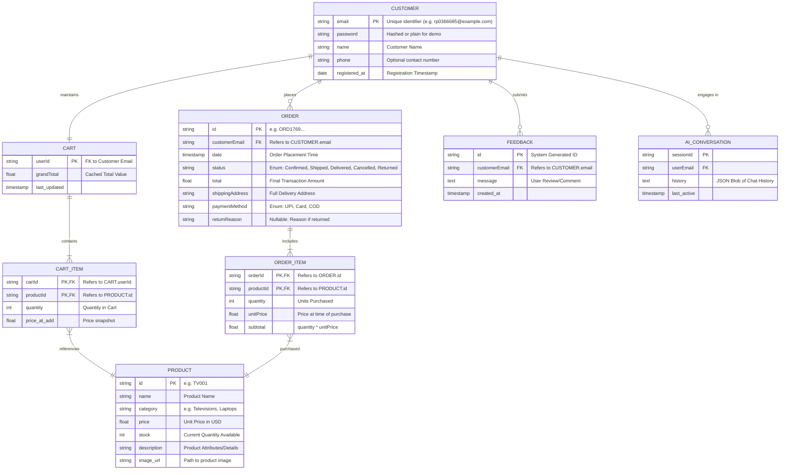

# Detailed Entity-Relationship Diagram (ERD)

This diagram represents the complete data schema used in the ElectroMinds application, including all attributes, primary keys (PK), foreign keys (FK), and relationship cardinalities.

