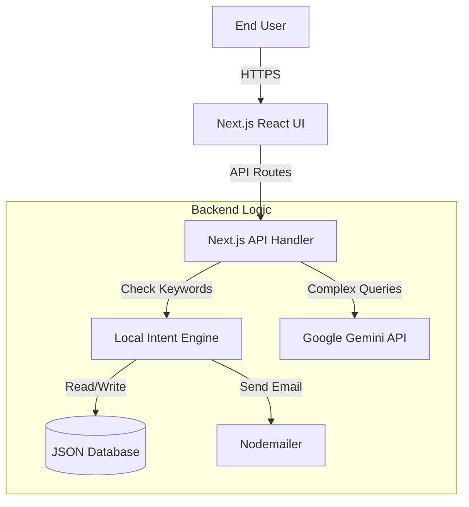

# ElectroMinds: Intelligent Omni-channel Electronics Assistant

This is a Next.js application powered by Google Gemini to act as an intelligent assistant for buying electronics.


## Background

In the rapidly expanding world of e-commerce, customers often feel overwhelmed by endless catalogs, complex filters, and impersonal purchasing processes. Finding the right electronic gadget usually involves navigating through dozens of pages, comparing specifications manually, and dealing with rigid checkout forms.

**ElectroMinds** was created to bridge this gap by introducing a **Conversational Commerce** experience. Unlike traditional search-and-click websites, ElectroMinds offers an intelligent, human-like assistant that understands natural language. Whether a user wants to "find a laptop under $1000", "modify their shipping address", or "return a product because it's broken", the assistant handles it instantly in a single chat interface. This project aims to demonstrate how Generative AI can transform a static online store into a dynamic, personalized shopping concierge.


## Requirement Overview

The system is designed to fulfill specific functional and user experience requirements:

### 1. Functional Requirements
*   **Intelligent Product Discovery**: Users should be able to find products using vague or natural language queries (e.g., "Show me good headphones for travel").
*   **End-to-End Order Processing**: The assistant must handle the entire lifecycle: adding items to cart, collecting shipping details, confirming orders, and sending digital receipts.
*   **Dynamic Order Management**: Users require the flexibility to track status in real-time, modify addresses for shipping orders, and initiate return requests effortlessly.
*   **Data Persistence**: All inventory, orders, and user feedback must be persistently, accurately stored and retrievable.

### 2. User Experience Goals
*   **Zero-Learning Curve**: The interface should be as simple as a chat app; no complex navigation menus.
*   **Context Awareness**: The AI must remember context (e.g., if a user asks about a TV and then says "buy it", the AI knows "it" refers to the TV).
*   **Visual Richness**: While the interaction is text-based, the responses should use rich UI elements (tables, status bars, images) to present information clearly.


## Solution Approach

To address these requirements effectively, we adopted a **Hybrid AI Architecture** that combines the reliability of traditional programming with the flexibility of Large Language Models (LLMs).

### 1. Hybrid Intelligence Engine
*   **Local Intent Engine (Rule-Based)**: For critical financial operations like *Placing Orders*, *Checking Stock*, or *Calculating Totals*, we use determinstic local logic. This ensures 100% accuracy and instant response times, avoiding the potential hallucinations or latency of pure LLMs.
*   **Generative AI Layer (Google Gemini)**: For *Product Recommendations*, *Natural Language Understanding*, and *User Engagement*, we leverage Google's Gemini Flash model. This provides the "personality" and flexibility to understand varied user phrasings.

### 2. Modern Tech Stack
*   **Web Framework**: Built on **Next.js 14 (App Router)** for a seamless, fast, and SEO-friendly single-page application experience.
*   **Data Layer**: A lightweight, file-based JSON database mimics a real SQL environment, allowing complete CRUD operations (Create Orders, Read Inventory, Update Stock) without complex infrastructure setup.
*   **UI Design**: A custom "Glassmorphism" design system ensures the application feels premium and trustworthy, differing from standard chat interfaces.


## Solution Architecture

The application follows a streamlined Model-View-Controller (MVC) adaptation for serverless environments:



*   **Frontend**: Client-side React components handling user inputs and rendering chat bubbles.
*   **API Layer**: Server-less functions (`/api/chat`) acting as the orchestrator.
*   **Local Intent Engine**: A high-performance logic block that intercepts transaction-related commands.
*   **External AI**: Google Gemini API is called only when creative text generation is needed.


## Technical Details

*   **Framework: Next.js 14+ (App Router)**
    *   *Why*: Chosen for its robust server-side API capabilities (`/app/api`) which allows us to hide API keys securely, and its efficient client-side rendering for a snappy UI.
*   **Language: JavaScript (ES6+)**
    *   *Why*: Logic is implemented in clean, modular JS functions allowing for rapid development and utilizing the massive ecosystem of npm packages.
*   **AI Model: Google Gemini 2.5 Flash**
    *   *Why*: Selected for its extremely low latency and high reasoning capability in e-commerce contexts, striking the perfect balance between speed and intelligence.
*   **Database: JSON File System**
    *   *Why*: We implemented a custom `lib/data.js` module that reads/writes to a generic `database.json`. This provides persistent storage without the overhead of setting up an external SQL server for the prototype/demo phase.
*   **Email Service: Nodemailer**
    *   *Why*: Integration to send real email receipts to users upon order confirmation, adding a layer of realism and trust to the system.


## Benefits of the Solution

1.  **Zero-Latency Transactions**: By handling "Buy" and "Track" commands locally, the system eliminates the lag usually associated with LLM processing.
2.  **Visual Confirmation**: The chat interface renders Rich UI elements (Tables, Order Cards) instead of just plain text, improving readability.
3.  **Robust Recovery**: The "Context Awareness" feature remembers what product the user was looking at. If a user says "Buy 2", the system knows they mean "2 Televisions" based on previous chat.
4.  **Flexibility**: The "Modify Order" feature allows users to self-correct mistakes (address/payment) without contacting support, reducing operational costs.


## Alternate Approach

We considered an alternative architecture using a **Monolithic Python Stack (Django/Flask) + PostgreSQL + OpenAI GPT-4**.

*   **Description**: This would involve building the entire backend logic in Python, leveraging Django's ORM for database management, and using OpenAI's GPT-4 API for intelligence.
*   **Why it was REJECTED**:
    *   **Complexity**: Requires maintaining two separate repositories (Frontend React + Backend Python) or a heavy full-stack setup.
    *   **Cost**: GPT-4 is significantly more expensive per token than Gemini Flash, making it less viable for a high-volume chatbot.
    *   **Infrastructure Overhead**: Setting up and hosting a PostgreSQL server requires cloud resources (like AWS RDS), whereas our JSON-based solution runs instantly in any Node.js environment, perfect for portability.
    *   **Unified Development**: Keeping the entire stack in JavaScript (Next.js) allowed for faster iteration, type safety, and simpler debugging.


## Assumptions

*   **Single Tenant Environment**: The current deployment assumes a single active user session (or guest mode) for demonstration purposes.
*   **Static Inventory**: We assume stock is deducted in real-time within the app but no external ERP system is modifying the inventory simultaneously.
*   **Currency**: All transactions are processed and displayed in USD ($).
*   **Authentication**: For the demo environment, we assume a simplified login flow where specific credentials (`rp0366685@example.com`) grant admin-like access, or guest access is permitted if configured.
*   **Delivery Time**: The "Shipped" and "Delivered" statuses are simulated based on time elapsed or manual triggers, rather than real logistics integration.

## Features
- **Product Recommendations**: Smart suggestions based on inventory.
- **Order Management**: Place, Track, Cancel, and Return orders.
- **Admin Tools**: Inventory updates (simulated) and Sales reporting.
- **Email Simulation**: Generates Markdown tables for order confirmations.
- **Premium UI**: Glassmorphism design with responsive chat interface.

## Setup

1. **Install Dependencies** (if not done):
   ```bash
   npm install
   ```

2. **Environment Variables**:
   Create a `.env.local` file in the root directory and add your Google Gemini API Key:
   ```env
   GEMINI_API_KEY=your_api_key_here
   ```
   *If you don't have a key, the app will simulate a connection failure or use a mock logic if configured.*

3. **Run Locally**:
   ```bash
   npm run dev
   ```
   Open [http://localhost:3000](http://localhost:3000).

## Usage
- **Customer**: "I want to buy a TV", "Track my order", "Cancel order ORD123".
- **Admin**: "Show me sales trends", "Update inventory".

## Tech Stack
- Next.js (App Router)
- React
- Google Generative AI SDK
- Vanilla CSS (Glassmorphism)
