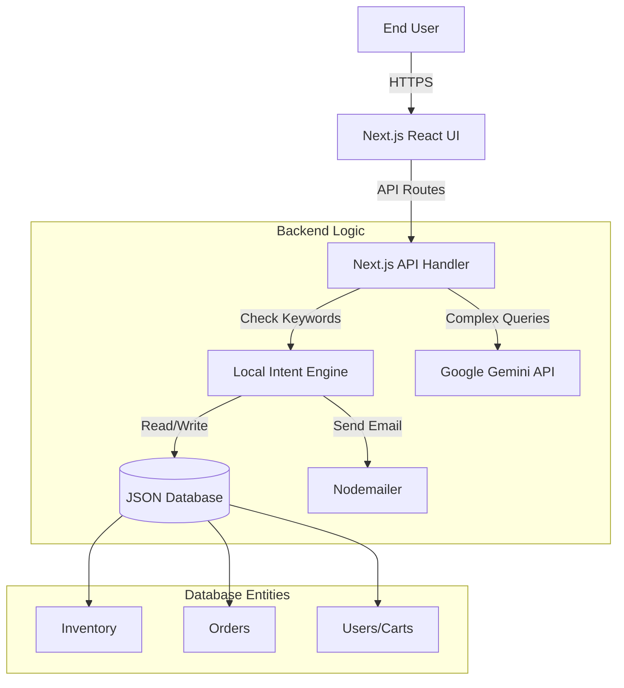

# Solution Document: ElectroMinds AI Chatbot

## 1. Background
In the rapidly evolving e-commerce landscape, customers demand instant, personalized, and efficient interactions. Traditional navigation-based shopping experiences can be overwhelming due to catalog size. ElectroMinds seeks to bridge this gap by introducing an intelligent conversational agent (chatbot) that allows users to shop, track orders, and manage returns through natural language, simulating a human store assistant.

## 2. Requirement Overview
The ElectroMinds system addresses the following key requirements:
*   **Product Discovery**: Users can search for products, view categories (Laptops, Phones, etc.), and check stock availability.
*   **Order Management**:
    *   **Buying**: Seamless "Add to Cart" and "Buy Now" flows using natural language (e.g., "Buy 2 iPhones").
    *   **Tracking**: Real-time status updates on orders (Processing -> Shipped -> Delivered).
    *   **Modification**: Ability to change shipping details or cancel orders *before* delivery.
    *   **Returns**: Automated return request handling with reason capture.
*   **User Engagement**:
    *   **Feedback System**: Collection of user reviews and ratings.
    *   **Recommendations**: Context-aware product suggestions based on browsing history.
*   **Security & Access**:
    *   Secure Login Portal (Mock Authentication implemented for demonstration).
    *   Admin Dashboard capabilities for revenue and inventory monitoring.

## 3. Solution Approach
The solution is built as a **Hybrid AI Web Application**.
*   **Frontend**: A responsive Chat UI built with **React** and **Next.js**, designed with a "Glassmorphism" aesthetic for a premium feel.
*   **Intelligence Layer**: A dual-engine approach:
    1.  **Local Intent Engine (Rule-based)**: Handles critical, deterministic tasks (Order placement, Database updates, Math) to ensure 100% accuracy and speed.
    2.  **Generative AI (Google Gemini)**: Handles "chit-chat", complex queries, and product recommendations, providing a human-like persona.
*   **Data Persistence**: A custom JSON-based file database ensures data portability and simplicity for this deployment phase, managing Inventory, Orders, and Carts.

## 4. Solution Architecture

### High-Level Diagram

### Entity Relationship Diagram
(See attached `ER_DIAGRAM.md` content for detailed field mapping)

## 5. Technical Details
*   **Framework**: **Next.js 14+ (App Router)** - Chosen for its robust server-side API capabilities ('/app/api') and efficient client-side rendering.
*   **Language**: **JavaScript (ES6+)** - Logic is implemented in clean, modular JS functions.
*   **AI Model**: **Google Gemini 2.5 Flash** - Selected for its low latency and high reasoning capability in e-commerce contexts.
*   **Database**: **JSON File System (`better-sqlite3` alternative)** - We implemented a custom `lib/data.js` module that reads/writes to a generic `database.json`. This provides persistent storage without the overhead of setting up an external SQL server for the prototype.
*   **Validation**: Custom Regex patterns are used to validate emails (`user@example.com`) and extract Order IDs (`ORD...`) securely.
*   **Email Service**: **Nodemailer** integration to send real email receipts to users upon order confirmation.

## 6. Benefits of this Solution
1.  **Zero-Latency Transactions**: By handling "Buy" and "Track" commands locally, the system eliminates the lag usually associated with LLM processing.
2.  **Visual Confirmation**: The chat interface renders Rich UI elements (Tables, Order Cards) instead of just plain text, improving readability.
3.  **Robust Recovery**: The "Context Awareness" feature remembers what product the user was looking at. If a user says "Buy 2", the system knows they mean "2 Televisions" based on previous chat.
4.  **Flexibility**: The "Modify Order" feature allows users to self-correct mistakes (address/payment) without contacting support, reducing operational costs.

## 7. Alternate Approch (Mandatory)
**Approach**: Monolithic Python Architecture (Django/Flask) + PostgreSQL + OpenAI GPT-4.
*   **Description**: Building the backend entirely in Python and using a traditional relational database.
*   **Why NOT chosen**:
    *   **Complexity**: Requires separate frontend (React) and backend (Python) hosting.
    *   **Cost**: GPT-4 is significantly more expensive per token than Gemini Flash.
    *   **Overhead**: Setting up PostgreSQL requires cloud infrastructure (AWS RDS), whereas our JSON solution runs instantly on any Node.js environment.
    *   **Unified Stack**: Keeping everything in JavaScript (Next.js) allowed for faster iteration and tighter type safety between UI and API.

## 8. Assumptions
*   **Single Tenant**: The current deployment assumes a single active user session or simplified multi-user simulation via cookies.
*   **Stock Static**: Inventory is decremented in real-time but we assume no external ERP system is modifying stock simultaneously.
*   **Currency**: All transactions are processed in USD ($).
*   **Authentication**: The login system uses hardcoded credentials (`rp0366685@example.com`) for the demo environment.

## 9. Screenshots of Apps Screens and Dashboards

*(Please refer to the following image files attached with this submission)*

*   **Figure 1: Product Catalog View** - Displaying rich table formatting for "Audio & Headphones".
    *   *Ref: `uploaded_media_0_1769275017048.png`*
*   **Figure 2: Mobile/Laptop Categories** - Clean categorized listing of high-value items.
    *   *Ref: `uploaded_media_1_1769275017048.png`*
*   **Figure 3: Ordering Flow** - User adding items to cart and selecting quantity ("45 x Bose QuietComfort").
    *   *Ref: `uploaded_media_2_1769275017048.png`*
*   **Figure 4: Order Confirmation** - The system capturing address and payment details securely.
    *   *Ref: `uploaded_media_3_1769275017048.png`*
*   **Figure 5: Order Tracking** - Real-time visual progress bar showing "Processing -> Shipped".
    *   *Ref: `uploaded_media_4_1769275017048.png`*
